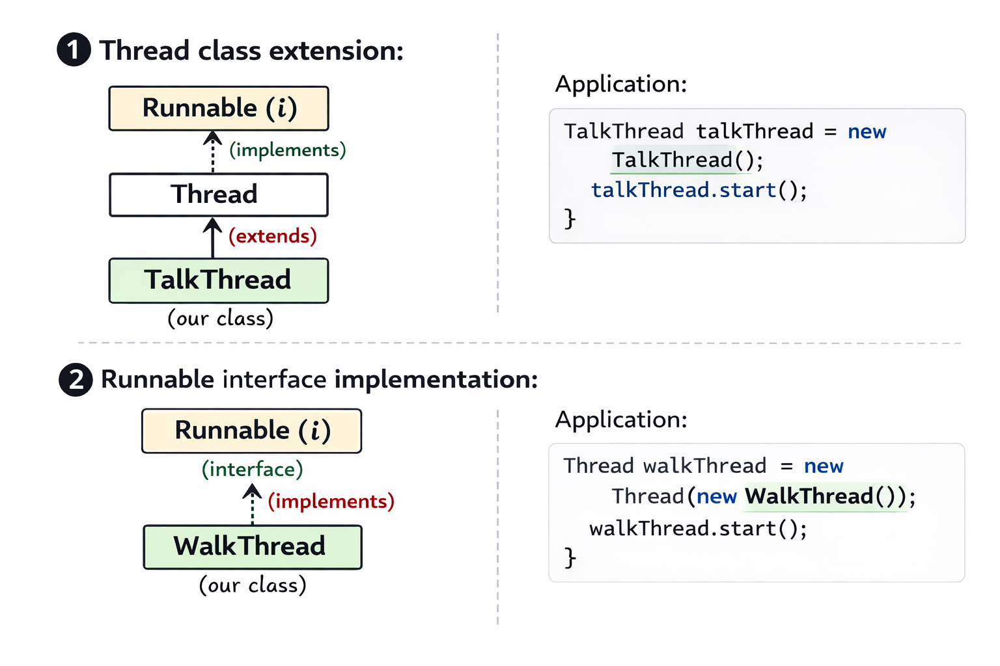

## Several ways to create & execute thread:
1. Extending **Thread** class 
2. Implementing **Runnable** interface
3. **Asynchronous** Thread Execution



### Example for Asynchronous thread execution

```text
Counter-two:...........
Counter-two:...........
Counter-two:...........
Counter-two:...........
Main.. sum is====================:15
Counter-one:...........
Counter-one:...........
Counter-one:...........
Counter-two:...........
```